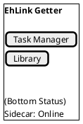
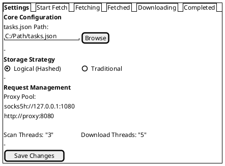
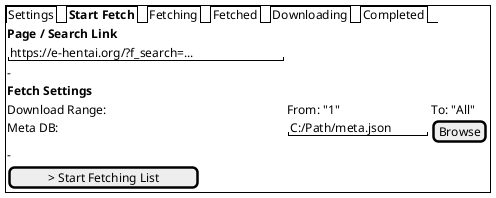
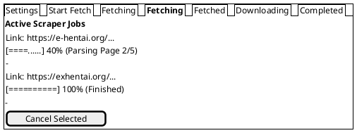
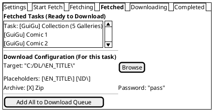
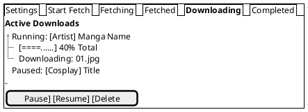
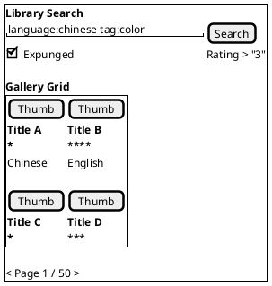

# UI Blueprints

This document outlines the user interface design for the new EhLink-Getter desktop application.

> **Design Constraint**:
>
> - **Layout & Metrics**: STRICTLY maintain `v0.0.1` layout styling (padding, margins, font sizes, sidebar width `240px`).
> - **Theme**: Apply **E-Hentai Theme** colors (Dark Gray backgrounds, distinct borders) replacing the current "glassmorphism/purple" theme.

## 0. Visual Style & Theme (E-Hentai)

| Component          | Current (v0.0.1)                | New (E-Hentai)                                                     |
| :----------------- | :------------------------------ | :----------------------------------------------------------------- |
| **App Background** | `bg-bg-dark` (Radial Gradient)  | `#34353b` (Flat Dark Gray)                                         |
| **Sidebar Bg**     | `bg-bg-sidebar` (Glass)         | `#2b2c31` (Darker Gray)                                            |
| **Text Color**     | `text-text-main` (White/Silver) | `#f1f1f1` (Main), `#b4b5bc` (Muted)                                |
| **Accent/Links**   | Purple/Indigo (`primary`)       | `#b3b3b3` (Standard) / `#ffae00` (Rating stars)                    |
| **Headers/Panels** | Transparent/Glass               | `#4f535b` (Panel Headers)                                          |
| **Borders**        | `border-glass-border`           | `#5c0d11` (Classic EH Red-Border for tables) or `#b4b5bc` (Subtle) |

## 1. Main Navigation Structure (Sidebar)

The sidebar (`el-aside`, width: 240px) remains the primary navigation controller.

## 2. Task Manager View (Main Content)

When **Task Manager** is selected in the sidebar, the Main Content area (`el-main`, padding: `p-10`) displays a **Tabbed Interface**.

**Tabs**: `[ Settings ] [ Start Fetch ] [ Fetching ] [ Fetched ] [ Downloading ] [ Completed ]`

### 2.1 Settings Tab

_Focus: Global Configuration & Request Management_

### 2.2 Start Fetch Tab

_Focus: Step 1 - Input Page/Search Links to Scrape_

### 2.3 Fetching Tab

_Focus: Step 2 - Monitor List Scraping Progress_

### 2.4 Fetched Tab (Review & Configure)

_Focus: Step 3 - Review Results & Configure Download Paths_

### 2.5 Downloading Tab

_Focus: Step 4 - Active Image Downloads_

## 3. Library View (Main Content)

When **Library** is selected in the sidebar, the Main Content area displays the Gallery.

_Style Note: Mimic E-Hentai Gallery Grid (padding, borders, background)._

