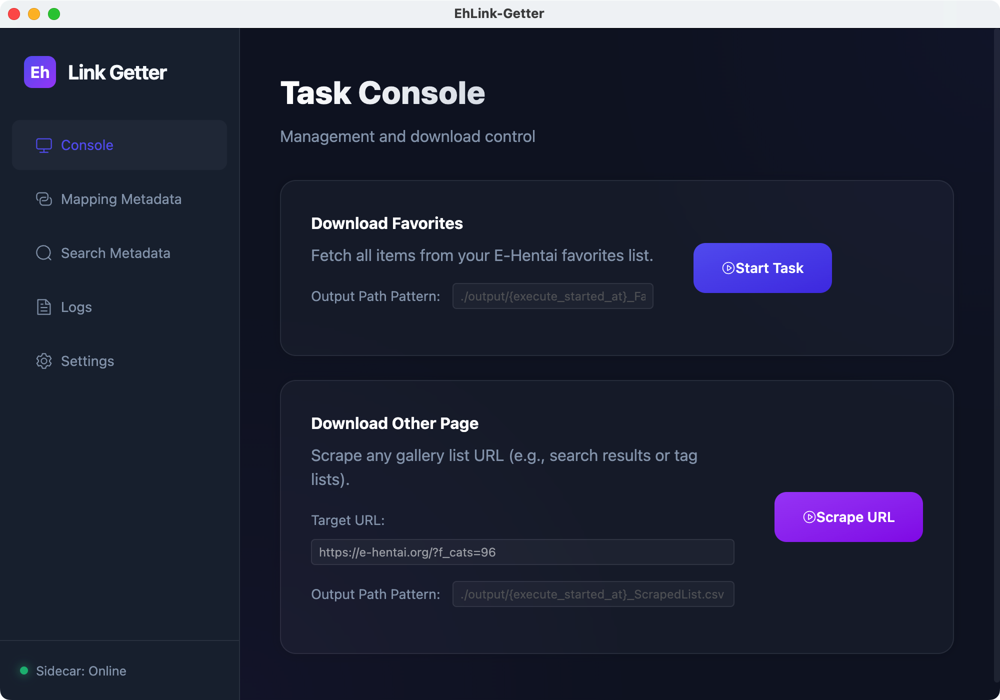
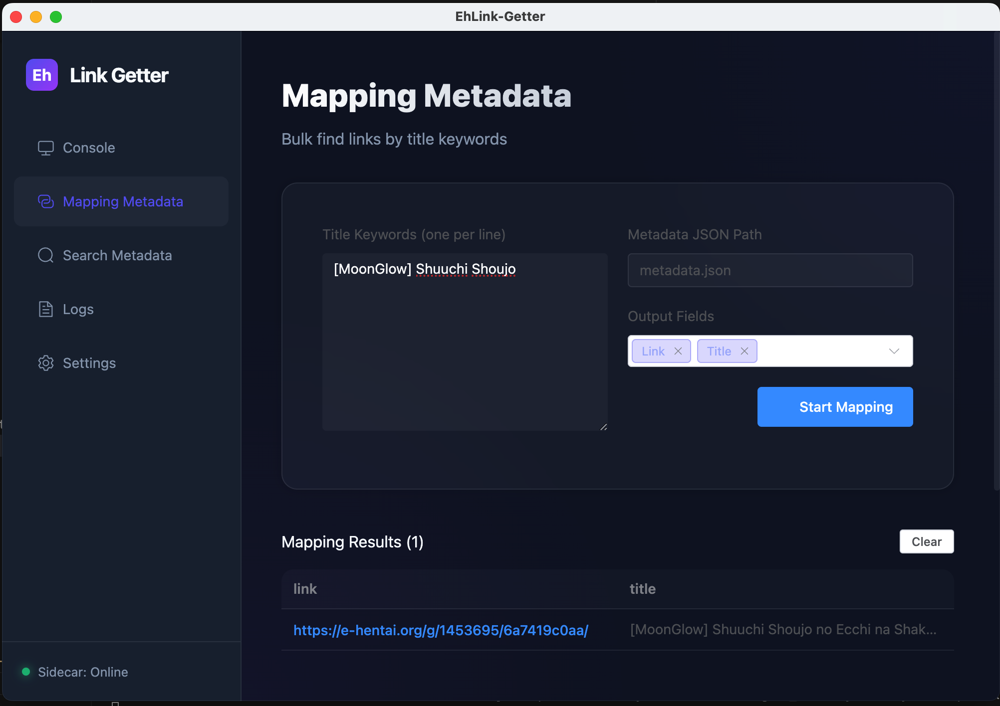
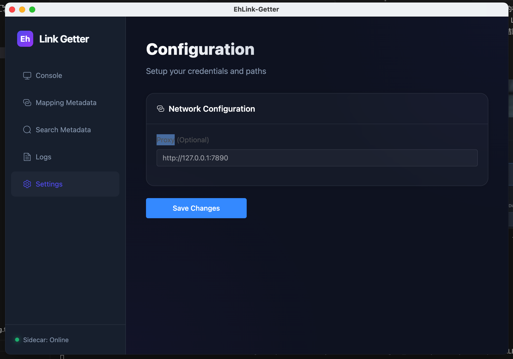

# EhLink-Getter 桌面版使用手冊

歡迎使用 EhLink-Getter！這是一個基於 Electron + Vue 3 開發的現代化工具，旨在幫助您輕鬆管理與抓取 E-Hentai 資源。

---

## 🚀 安裝指南

### 1. 取得程式

目前程式支援自行編譯或從發行(Release)頁面下載安裝檔。

### 2. 環境需求

- **作業系統**: Windows 10+, macOS 11+, 或主流 Linux 發行版。
- **本地組件**: 若您是開發者，請確保已安裝 Node.js 18+ 與 Python 3.9+。

---

## 核心功能說明

### 1. 任務控制台 (Task Console)

這是程式的核心入口，用於下載您的收藏夾列表。

- **輸出路徑設定**: 您可以自定義下載的檔名格式。例如：`./output/{execute_started_at}_FavoriteList.csv`。
  - `{execute_started_at}` 會自動替換為當前的執行時間 (YYYYMMDD_HHMMSS)。
- **開始任務**: 點擊「Start Task」開始抓取。
- **終止任務**: 在任務執行中，您可以點擊「Stop Task」立即停止。程式會確保清理未完成的快取。

### 2. 元數據映射 (Mapping Metadata)

如果您有龐大的 `metadata.json` 索引檔，這個功能可以幫助您快速根據「標題關鍵字」找出對應的連結。

- **關鍵字輸入**: 在左側輸入框輸入您要搜尋的標題，一行一個。
- **設定**: 指定您的 `metadata.json` 路徑，並選擇您想要輸出的欄位（如 Title, Link, GID 等）。
- **映射結果**: 點擊開始後，結果會直接顯示在下方的表格中，支援直接點擊連結點開網頁。

### 3. 設定頁面 (Settings)

在使用爬蟲功能前，請務必先完成設定。

- **Cookie 設定**: 請貼入您的 E-Hentai Session Cookie (包含 `ipb_member_id`, `ipb_pass_hash` 等)。
- **路徑設定**: 設定預設的下載資料夾與元數據檔案路徑。
- **代理伺服器**: 若您需要透過 VPN/Proxy 訪問，請在此設定代理 URL。

---

## 🛠️ 常見問題處理

- **Sidecar Offline?**: 確保您的 Python 環境已安裝 `sidecar/requirements.txt` 中的所有套件。
- **抓取失敗?**: 請檢查 Cookie 是否過期，或代理伺服器是否連通。
- **找到不到檔案?**: 請確認在設定頁面中填寫的是「絕對路徑」或相對於程式執行檔的正確路徑。

---

_祝您使用愉快！如有問題請參考專案 GitHub 頁面。_
