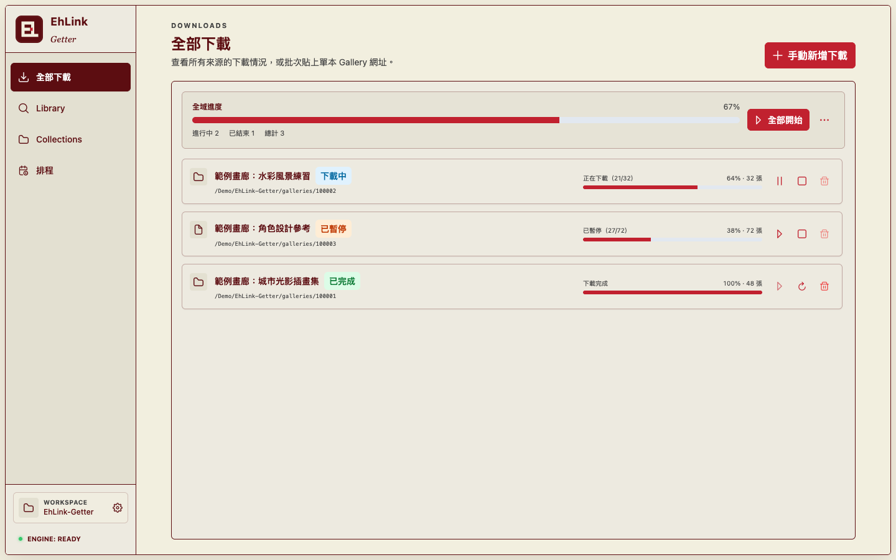
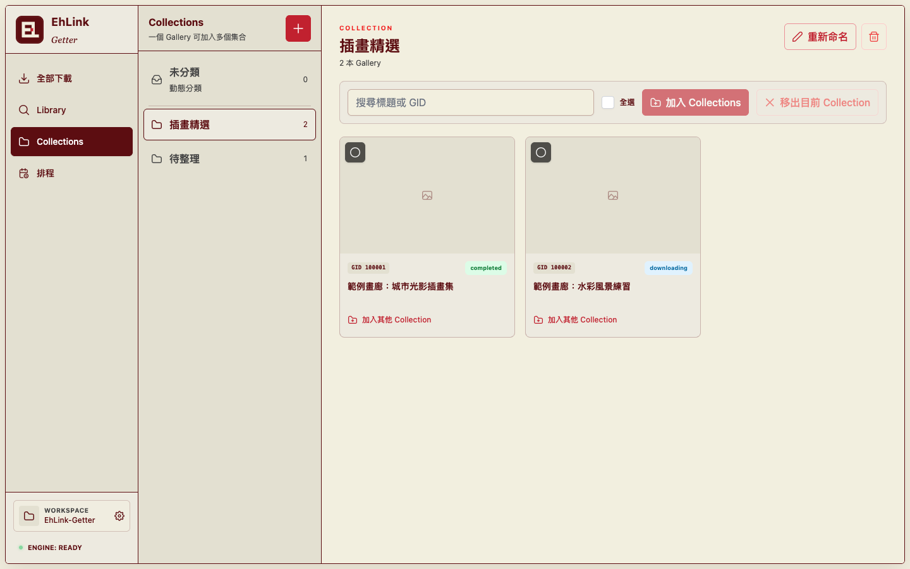

# EhLink-Getter

[](https://github.com/twkevinzhang/EhLink-Getter/releases/latest)
[](https://github.com/twkevinzhang/EhLink-Getter/releases)

EhLink-Getter 是一款用來管理與下載 **E-Hentai Gallery** 的桌面應用程式。它將下載、Collections、排程與工作紀錄集中在你選擇的 Workspace。

> 僅支援 E-Hentai。請自行確認使用方式符合網站規範、著作權與所在地法律。

## 功能一覽

- **批次手動下載**：在「全部下載」貼上多個 Gallery 網址，每行一筆；系統會略過無效網址、合併重複工作，並顯示處理結果。
- **下載佇列**：以每本 Gallery 為單位管理下載狀態、進度與錯誤；可在中斷後重新處理，已存在的圖片會略過。
- **Workspace**：選擇一個工作資料夾後，應用程式會將 Gallery、Collections、排程與下載紀錄集中保存在其中。
- **Collections**：建立自己的分類，將已管理的 Gallery 加入一個或多個 Collection，並在 Collection 內搜尋或整理。
- **排程**：監看 E-Hentai 頁面並依每隔數小時、每日、每週或自訂 Cron 執行；可限制掃描頁數、指定目標 Collection，並暫停或恢復該排程建立的下載。
- **Library 搜尋**：應用程式會將下載的 Library metadata 匯入本機 SQLite，並建立全文搜尋（FTS5）索引。你可以依文字、標籤、評分與是否包含 Expunged 資料查找 Gallery。



### 用 Collections 整理 Gallery

一個 Gallery 可以加入多個 Collection。你也能搜尋標題或 Gallery ID（GID），再批次調整分類。



### 依排程追蹤更新

排程會保存最近一次執行結果，並分開控制監看與自動下載。暫停自動下載後，排程仍會繼續監看新 Gallery。


## 下載與支援平台

請從 [GitHub Releases](https://github.com/twkevinzhang/EhLink-Getter/releases) 下載最新版。目前 `v0.0.7` 提供：

| 平台                | 發行格式        | 說明                       |
| ------------------- | --------------- | -------------------------- |
| Windows x64         | Portable `.exe` | 免安裝，下載後可直接執行。 |
| macOS Apple Silicon | `.dmg`、`.zip`  | 適用於 Apple Silicon Mac。 |

請只從官方 Release 下載檔案。若 Windows SmartScreen 或 macOS Gatekeeper 顯示未辨識開發者警告，請先核對下載來源與 Release 資訊，再依作業系統的安全提示決定是否開啟。

## 快速開始

1. 從 [Releases](https://github.com/twkevinzhang/EhLink-Getter/releases) 下載適合你的版本並啟動應用程式。
2. 點選側欄底部的 **Workspace**，選擇一個專用工作資料夾。這個資料夾會保存本子、Collections、排程與下載紀錄。
3. 在 **設定** 的 **Cookies** 區塊按下 **Login to E-Hentai** 登入，或貼上你的 Cookie JSON 後儲存設定。需要登入權限的內容必須先完成此步驟。
4. 前往 **全部下載**，按下「手動新增下載」，每行貼上一個 E-Hentai Gallery 網址，選擇要加入的 Collections 後建立下載工作。
5. 在下載佇列查看進度；需要追蹤特定頁面時，可到 **排程** 建立監看規則。

## 常見工作流程

### 下載一批 Gallery

```text
選擇 Workspace
      ↓
全部下載 → 手動新增下載 → 貼上多個 Gallery 網址
      ↓
選擇 Collections（可略過） → 建立下載工作
      ↓
在下載佇列查看進度與結果
```

相同 Gallery 不會建立重複下載工作；已納管的 Gallery 可以直接加入新的 Collection。

### 建立自動追蹤

1. 先建立一個 Collection（選填，但方便分類）。
2. 前往 **排程** 並建立規則，填入要監看的 E-Hentai 網址。
3. 設定執行頻率、每次掃描的頁數上限，以及新發現 Gallery 要加入的 Collection。
4. 儲存後可立即手動執行；排程下載也能個別暫停與恢復。

### 搜尋 Library metadata

1. 前往 **Library**，下載 metadata。
2. 等待匯入本機 SQLite 資料庫並完成 FTS5 索引建立。
3. 使用文字與標籤查詢，例如 `language:chinese tag:color`；也可設定最低評分與是否包含 Expunged 結果。

Library 是用來查找 E-Hentai metadata 的本機索引；實際已下載的 Gallery 則在 Workspace 中管理。

## 資料與隱私

- Workspace 由你選擇位置，應用程式會在其中保存 Gallery 資訊、Collections、排程、下載佇列與設定。
- 應用程式會將 Library metadata 匯入本機 SQLite，並建立 FTS5 搜尋索引。
- 應用程式會保存 Cookie，並在向 E-Hentai 發出請求時使用。請勿分享自己的 Cookie 或 Workspace。
- 設定代理伺服器後，應用程式的網路請求會經過該伺服器。請只使用你信任的 HTTP 或 HTTPS 代理伺服器。

## 開發

開發環境、建置與封裝說明請見 [DEVELOPMENT.md](./DEVELOPMENT.md)。

目前預設抓取服務直接在 Electron main process 以 TypeScript 執行。為了過渡期間的回退需求，發行版本仍包含暫時性的 Go sidecar；僅在開發或除錯時設定 `EH_SCRAPER_BACKEND=go` 才會改用它。未設定或設為 `ts` 時，皆使用預設的 TypeScript 後端。

## 回報問題

使用時若遇到錯誤，請到 [GitHub Issues](https://github.com/twkevinzhang/EhLink-Getter/issues) 回報，並附上：

- 使用的應用程式版本與作業系統；
- 可重現問題的操作步驟；
- 不含 Cookie、帳號或個人路徑的錯誤訊息或截圖。
