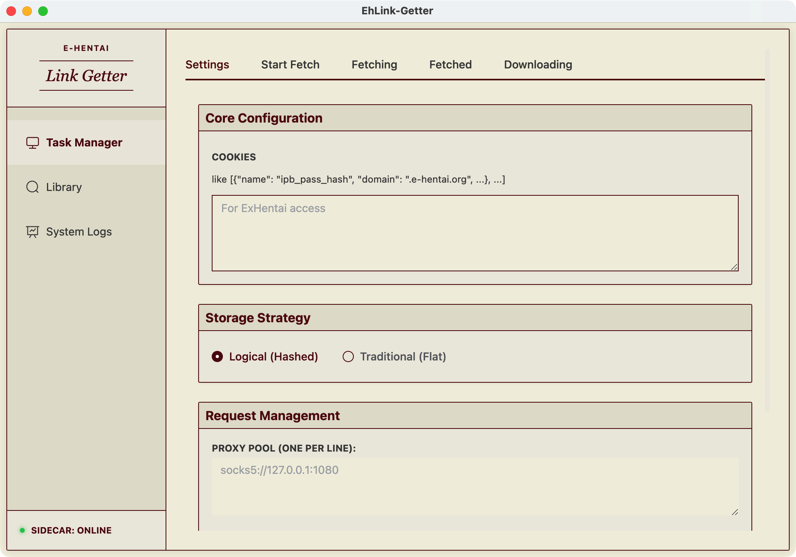
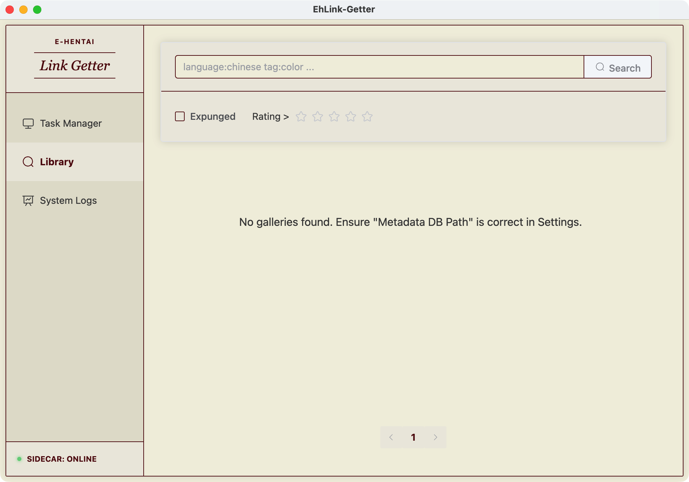
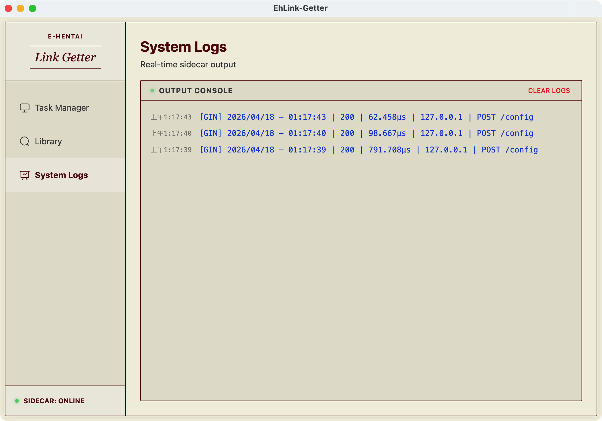

# 📜 EhLink-Getter

**EhLink-Getter** 是一款專為 E-Hentai 愛好者打造的桌面端工具。它結合了現代化的介面設計與高效能的抓取技術，幫助您輕鬆管理、搜尋並獲取畫廊連結。

---

## ✨ 核心特色

### 🚀 強大的任務管理器 (Task Manager)

無論是搜尋結果、收藏夾，還是特定的標籤類別，只需輸入網址，EhLink-Getter 就能為您快速提取所有連結。支援分頁抓取與即時進度顯示。

- **全方位支援**：相容 Minimal, Compact, Extended, Thumbnail 等多種 E-Hentai 顯示模式。
- **即時解析**：自動提取畫廊標題與連結，並支援即時導出為 CSV 格式。
- **靈活控制**：隨時開始、停止或儲存抓取結果。

### 🔍 在地化選集與搜尋 (Library)

將您的 `metadata.json` 轉換為強大的在地搜尋引擎。支援模糊搜尋，讓您在海量資料中秒速找到心儀的內容。

- **極速檢索**：採用 Node.js 原生串流技術，處理數 GB 的資料依然流暢。
- **批量對照**：支援將標題清單批量映射為畫廊連結，省去手動搜尋的煩惱。

### 🛠️ 透明的系統監控

透過內建的日誌系統，您可以即時監控 Sidecar 抓取引擎的運作狀況。

- **結構化日誌**：清晰掌握每一次網路請求與資料解析進度。
- **高效穩定**：底層採用 Go 語言驅動，兼具高效能與低資源佔用。

---

## 🛠️ 其他亮點

- 🎨 **現代化設計**：基於 Vue 3 與 Element Plus，採用毛玻璃 (Glassmorphism) 風格，視覺體驗純淨優雅。
- 📊 **Excel 友善**：導出的 CSV 檔案自動加入 UTF-8 BOM，確保在 Excel 中開啟不亂碼。
- 🔒 **靈活配置**：輕鬆設定 Cookies 與代理伺服器 (Proxy)，確保抓取流程順暢。

---

## 🚀 快速上手

想要開始使用嗎？

1.  前往 [Releases](https://github.com/twkevinzhang/EhLink-Getter/releases) 下載適用於您系統的安裝包 (Windows 或 macOS)。
2.  安裝並啟動應用程式。
3.  在 **Configuration** 中設定您的 Cookies。
4.  開始您的抓取之旅！

> [!TIP]
> 更詳細的操作說明請參閱：[使用手冊 (正體中文)](./USER_MANUAL.zh-TW.md)

---

## 👩‍💻 開發者資訊

如果您想自行編譯或了解技術架構，請參閱：

- [Development Guide](./DEVELOPMENT.md) - 技術架構與開發設定
- [CLAUDE.md](./CLAUDE.md) - 開發手冊與規範

---

## 📜 授權條款

本專案採用 [MIT License](./LICENSE) 授權。
