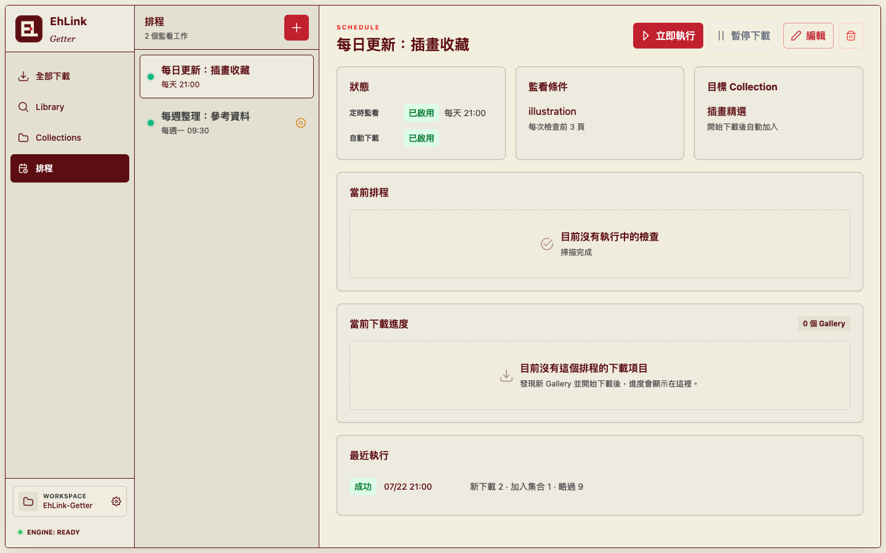

# 📜 EhLink-Getter

**EhLink-Getter** 是一款專為 E-Hentai 愛好者打造的強大桌面工具。它結合了極致的效能、自動化的排程與現代化的設計，讓您能輕鬆管理、搜尋並自動獲取心儀的畫廊資訊。

---

## ✨ 核心功能

### 🚀 任務管理與抓取 (Task Manager)

只需提供網址，即可快速解析並下載畫廊資訊。無論是搜尋結果、特定分類還是您的個人收藏夾，EhLink-Getter 都能輕鬆處理。

- **智慧解析**：自動提取 GID、Token、標題及畫廊連結，並標註頁數。
- **即時回饋**：抓取過程即時顯示，支援隨時暫停、恢復或儲存結果。

### 📚 收藏庫與高效搜尋 (Library)

將您的資料在地化，打造屬於自己的選集資料庫。即使擁有數萬條資料，也能在秒級內完成搜尋。

- **極速串流技術**：採用 Node.js 高效能串流處理，讀取數 GB 級別的 `library.json` 依然流暢不卡頓。
- **GID 核心索引**：全新的資料格式，支援精確的 metadata 對照與映射。
- TODO: ~~批量映射：支援將標題清單自動對應為畫廊連結，大幅節省整理時間~~。

### 🕒 自動化抓取排程 (Scheduler)

不再需要手動重複抓取。設定好排程，讓程式在後台為您自動更新追蹤。

- **彈性排程**：自定義 Cron 運算式，設定精準的任務執行時間。
- **背景執行**：無需保持視圖開啟，系統會自動在後台處理逾期任務。

### 📥 專業級下載引擎 (Download Engine)

內建基於 Node.js JobManager 的全新下載系統，提供穩定且高效的下載體驗。

- **斷點續傳**：下載中中斷？沒關係。支援自動跳過已下載圖片，從斷點處繼續。
- **併發控制**：自定義同時下載的任務數，在速度與穩定性間取得平衡。
- **即時狀態**：每個下載任務都有詳細的進度條與狀態顯示。

---

## 🎨 卓越的設計與體驗

- 💎 **精緻介面**：基於 **Vue 3** 與 **PrimeVue v4** 打造，擁有豐富的轉場動畫與優化的佈局設計。
- ⚙️ **整合監控**：內建 Sidecar 日誌查看器，讓抓取引擎的運作狀況一目了然。

---

## 🚀 快速上手

1.  **下載並安裝**：前往 [Releases](https://github.com/twkevinzhang/EhLink-Getter/releases) 下載適用於您系統的安裝包 (Windows 或 macOS)。
2.  **基本配置**：啟動後進入 **Task Console** 的 **Settings** 分頁，填入您的 E-Hentai Cookies，你也可以點擊右邊的「login」按鈕來從網頁登入。
3.  **開始任務**：點擊「開始」即可見證抓取魔力。

---

## 👩‍💻 開發者資訊

如果您是開發者，想深入了解技術細節或參與貢獻：

- [Development Guide](./DEVELOPMENT.md) - 技術架構與編譯指南
- [CLAUDE.md](./CLAUDE.md) - 開發手冊與規範
- **技術棧**：Electron, Vue 3, TypeScript, Go Sidecar, Node.js Streams

---

## 📜 授權條款

本專案採用 [MIT License](./LICENSE) 授權。

Co-Authored-By: Antigravity <antigravity@google.com>

